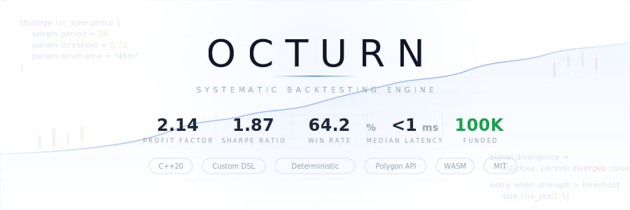

<p align="center">
  <b>C++20 strategy DSL & backtesting engine for quantitative trading research</b>
</p>

<p align="center">
  
  
  
  
  
</p>

---

Octurn lets you write trading strategies in a **clean, declarative DSL** — then parses, interprets, and evaluates them against real market data through a native C++ pipeline.

```octurn
strategy SimpleMA {
  parameters {
    fast_ma: 5
    slow_ma: 30
  }
  indicators {
    RSI1 = RSI(AAPL_close, 12)
  }
  entry { when RSI1 > 50 }
  exit  { when RSI1 > 250 }
}
```

<br>

## ⚙️ Pipeline

```
                    ┌─────────────────────────────────────────────┐
                    │              .oct strategy file             │
                    └────────────────────┬────────────────────────┘
                                         │
                                         ▼
         ┌───────────┐    ┌───────────┐    ┌───────────┐    ┌──────────────┐
         │   Lexer   │───▶│  Parser   │───▶│    AST    │───▶│ Interpreter  │
         │ tokenize  │    │ recursive │    │  nodes &  │    │  evaluate &  │
         │  stream   │    │  descent  │    │   exprs   │    │   resolve    │
         └───────────┘    └───────────┘    └───────────┘    └──────┬───────┘
                                                                   │
                                                    ┌──────────────┼──────────────┐
                                                    ▼              ▼              ▼
                                              ┌──────────┐  ┌──────────┐  ┌──────────┐
                                              │ Polygon  │  │   TA     │  │ Backtest │
                                              │ OHLC data│  │ RSI, MA  │  │  engine  │
                                              └──────────┘  └──────────┘  └──────────┘
```

**Input** → `.oct` script + Polygon.io API key  
**Output** → indicator series, entry/exit signals, trade log, equity tracking

<br>

## 📝 DSL Syntax

Three top-level blocks define a complete strategy:

<table>
<tr>
<td width="50%">

**`config`** — execution parameters

```
config {
  equity: 100
  positionSize: 1
  slippageBps: 10
}
```

</td>
<td width="50%">

**`data`** — market data sources

```
data [
  { ticker: AAPL  timespan: day
    multiplier: 1
    from: 2025-09-01
    to: 2025-10-27 }
]
```

</td>
</tr>
</table>

**`strategy`** — the core logic block

```octurn
strategy MyStrategy {
  parameters {
    period: 14
    threshold: 50
  }
  indicators {
    RSI1 = RSI(AAPL_close, period)
  }
  entry { when RSI1 > threshold }
  exit  { when RSI1 > 80 }
}
```

<br>

## 🔍 How It Works

### Lexer
Breaks `.oct` source into a typed token stream — keywords, identifiers, literals, operators, delimiters.

### Parser
Recursive descent parser that consumes tokens and builds a structured AST. Handles nested blocks: `config` → `data` → `strategy` → `parameters` | `indicators` | `entry` | `exit`.

### Interpreter
Walks the AST and evaluates:
- **Data resolution** — fetches OHLC bars from Polygon.io via async REST calls
- **Indicator dispatch** — computes RSI, MA (extensible TA library)
- **Signal evaluation** — evaluates boolean entry/exit conditions → produces signal arrays
- **State machine** — `parse → wait_for_data → ready → run`

### Backtester
Consumes signal arrays + price data → simulates order execution with slippage modeling → tracks positions, equity curve, and trade log.

### Execution Engine
Translates signals into order-level events. Structured for future live/paper execution bridge.

<br>

## 🏗️ Architecture

```
Octurn/
│
├── lexer/            Tokenizer
├── parser/           Recursive descent → AST
├── node/             AST node types
├── interpreter/      Runtime evaluation engine
├── engine/           Top-level orchestrator
│
├── ta/               Technical analysis (RSI, MA)
├── backtester/       Backtest simulation loop
├── execution/        Order generation from signals
├── trade/            Trade tracking & types
│
├── config/           Config parsing + validation + slippage tables
├── mappers/          API response → internal types
├── dataLayer/        Market data view abstraction
├── src/polygon/      Polygon.io REST client & data feed
│
├── injector/         Dependency injection
├── log/              Structured logging
├── utils/            Shared helpers
├── types/            Core types (OHLC, bars, series)
│
├── CMakeLists.txt
└── main.cpp
```

<br>

## 📊 Runtime Output

```
Octurn Runtime
══════════════

Config
──────
equity        : 100
positionSize  : 1
slippageBps   : 10

Data Sources
────────────
AAPL │ day │ 1x │ 2025-09-01 → 2025-10-27 │ 40 bars
MSFT │ day │ 1x │ 2025-08-01 → 2025-10-27 │ 61 bars

Indicators
──────────
RSI1   length = 40
  tail : [49.03, 51.62, 48.39, 56.07, 67.06, 67.53, 59.90, 61.15, 64.61, 70.00]

Signals
───────
Entry  [12..27, 31, 33..39]    23 hits
Exit   []                       0 hits
```

<br>

## 🚀 Quick Start

**Build**

```bash
mkdir build && cd build
cmake ..
cmake --build .
```

> Requires [`cpr`](https://github.com/libcpr/cpr) and [`nlohmann/json`](https://github.com/nlohmann/json) — install via vcpkg, Homebrew, or system package manager.

**Run**

```cpp
#include "engine/octurn.hpp"

int main() {
    std::string script = R"(
        config { equity: 100 positionSize: 1 slippageBps: 10 }
        data [
            { ticker: AAPL timespan: day multiplier: 1
              from: 2025-09-01 to: 2025-10-27 }
        ]
        strategy RSI_Cross {
            parameters { period: 14 }
            indicators { RSI1 = RSI(AAPL_close, 12) }
            entry { when RSI1 > 50 }
            exit  { when RSI1 > 80 }
        }
    )";

    octurn engine(script, "YOUR_POLYGON_API_KEY");
    engine.run();
}
```

<br>

## 🗺️ Roadmap

| Feature | Status |
|---|---|
| Core DSL (config / data / strategy blocks) | ✅ Done |
| Lexer → Parser → AST pipeline | ✅ Done |
| Interpreter + signal evaluation | ✅ Done |
| Polygon.io data integration | ✅ Done |
| RSI / MA indicators | ✅ Done |
| Backtester with slippage | ✅ Done |
| Execution engine scaffold | ✅ Done |
| Multi-condition logic & cross-asset rules | 🔜 Next |
| More indicators (EMA, MACD, Bollinger, ATR) | 🔜 Next |
| Backtest metrics (Sharpe, drawdown, PF) | 🔜 Planned |
| JSON runtime export | 🔜 Planned |
| Diagnostic error messages | 🔜 Planned |
| Portfolio-level logic | 🔜 Planned |
| Execution bridge (paper → live) | 🔜 Planned |
| WASM compilation for web | 🔜 Planned |

<br>

## 📄 License

MIT

<br>

---

<p align="center">
  <sub>Built with C++20 · Strategy-first design · Open for collaboration</sub>
</p>
